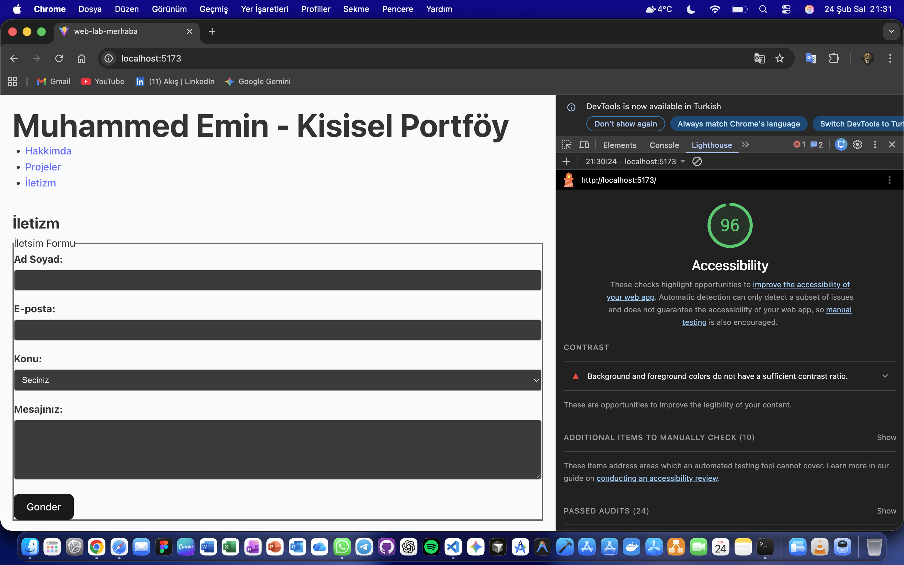

# Web LAB-1

## Hakkinda
Bu proje, Web Tasarimi ve Programlama dersi LAB-1 kapsaminda Vite + React + TypeScript kullanilarak olusturulmustur.

## Gelistirici
**Ad Soyad:** Muhammed Emin
**Ogrenci No:** [235541088]

## Kullanilan Teknolojiler
- React 18
- TypeScript
- Vite
## Erişilebilirlik Testi
Lighthouse erişilebilirlik puanım: 96

## Kurulum
```bash
npm install
## Erişilebilirlik Testi
Lighthouse erişilebilirlik puanım: 96
